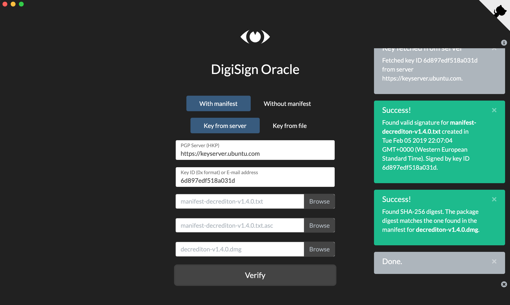

# DigiSign Oracle

DigiSign helps you verify digital signatures, letting you know the truth it sees, as an Oracle (hence the name).

To trust an Oracle one must understand the way it operates and this is why I'm releasing the source code.

This repository contains the source code for DigiSign Oracle. It does not require special privileges to run and runs on HTML5, JavaScript and CSS. DigiSign Oracle has been tested on Google Chrome and Mozilla Firefox.

If you would like to learn more about digital signatures, read the article [Verifying digital signatures](https://exploitedbunker.com/articles/verifying-digital-signatures/).

### Why?

Initial use case: to provide [Decred Project](https://decred.org) users with a graphical interface option to verify the digital signature of Decred packages downloaded from Github. You can watch this code running on [Stakey Club](https://stakey.club/digisign-oracle) at https://stakey.club/digisign-oracle.

DigiSign Oracle can verify any package signed with PGP.

## Release notes

This repository contains all DigiSign files. 

**Folder assets/icons and files package.json and main.js**: used by Node.js and Electron.js to create the platform independent user experience. If you're not going to run Node.js or Electron.js from command line or generate the Electron package, you can safely remove these items.

**Folder screenshots**: shows you what to expect from the software. You can safely remove this folder from your local installation.

**Folder test**: contains test scripts. They're not necessary for local or remote execution and you can safely remove them.

## Execution

#### To run DigiSign as a local webpage on your computer

- Clone this repository on your web server
- Open index.html on your preferred web browser.

#### To run DigiSign on a website

- Clone this repository on your computer
- Reference index.html on your website
- Navigate to index.html

#### To run DigiSign as an independent software

- Generate the binary executable file for your platform using Node.js and Electronjs
- Run the executable

The user can change the theme (Default or Dark) clicking on the logo. The choice will be saved in localStorage for the next run.

## Test

You can generate manifest text files and sign them using the script provided in the test folder.

Just run tester.sh to generate all manifests and sign them all using a test PGP key pair generated for this purpose.

When you're done, run cleaner.sh to remove the files tester.sh created.  

## Troubleshooting

If you encounter an error:

> TypeError: Failed to fetch. It may be related to 'Access-Control-Allow-Origin' header not present on the requested resource: https://keyserver.ubuntu.com. Try DigiSign Oracle locally on your computer or select "Key from file"

It is probably related to CORS. CORS is a security mechanism in HTTP headers to prevent the browser from using data from a different origin. It is expected to happen if you're running DigiSign Oracle from GitHub Pages, for example, because it lacks the header 'Access-Control-Allow-Origin'.

Please check [https://developer.mozilla.org/en-US/docs/Web/HTTP/CORS](https://developer.mozilla.org/en-US/docs/Web/HTTP/CORS) to learn more about it.

### Screenshots

#### Ready to run

#### Ready to run (dark mode)

#### Successful validation of a digital signature

